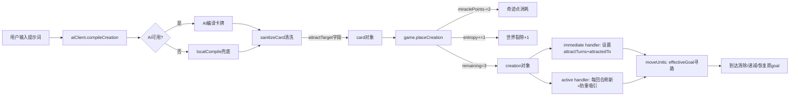

## 产品概述

为造物卡新增"吸引"（attract）能力。放置后，在生效时间（3回合）与空间范围（距离2）内，符合提示词指定的吸引对象将依据寻路逻辑朝造物卡放置点移动，到达后恢复原目标。消耗奇迹点 cost=2，触发世界裂隙（entropy）+1。

## 核心功能

- **提示词动态解析吸引对象**：按类别关键词匹配——含「巨兽/兽」→beast；含「村民/人/NPC/平民/居民/信使/使者」→civilian+信使；含「所有/全部/一切」→全部活跃单位；未指明时默认吸引巨兽（beast）。
- **寻路移动覆盖**：被吸引单位朝造物卡放置点做 A* 寻路移动，覆盖原目标；到达放置点后清除吸引状态、恢复原目标继续寻路。
- **回合倒计时**：持续时间3回合，creation.remaining 到期后吸引自然终止。
- **资源消耗与裂隙变动**：放置时扣除奇迹点2、世界裂隙+1（走现有 placeCreation 统一流程）。
- **巨兽行为保留**：被吸引期间巨兽仍正常涨怒气、仍触发陷阱，仅改变移动方向。

## 技术栈

- 纯前端 vanilla JS（ES Modules），Three.js 渲染，无构建步骤
- 能力元数据单一真相源：`abilities.js`（被 server.js / aiClient.js / validationEngine.js / creatorWorkshop.js 共享）
- 能力处理器策略模式：`abilityHandlers.js`（immediate 放置即效 + active 每回合持续）
- 提示词编译：`aiClient.js`（AI 编译 + 本地 localCompile 兜底 + sanitizeCard 统一清洗）
- 移动系统：`gameEngine.js`（A* 寻路 nextStepToward + moveCivilian/moveMessenger/moveBeast），`game.js` 子类重写 moveBeast/nextStepToward

## 实现方案

### 核心设计：Effective-Goal 覆盖模式

现有移动系统所有单位都朝 `unit.goal` 寻路。吸引能力的本质是**临时将单位的有效目标替换为造物卡放置点**，而非修改 unit.goal 本身。采用与 `guidedTurns` 同类的临时字段模式：

- `unit.attractedTo = { x, y, creationId }` — 吸引目标点 + 关联 creation 引用
- `unit.attractTurns = N` — 吸引剩余回合数

在 moveCivilian/moveMessenger/moveBeast 中计算 `effectiveGoal = (unit.attractTurns > 0 && unit.attractedTo) ? unit.attractedTo : unit.goal`，传入 nextStepToward。移动后递减 attractTurns；若已到达 attractedTo 则清除吸引状态并恢复原 goal。

### 防重吸引机制

单位到达放置点后若仍处于 creation 存续期，active handler 会重新吸引它导致振荡。采用 per-creation `arrivedIds` Set 解决：到达时将 unit.id 加入 `creation.arrivedIds`，active handler 跳过已到达单位。creation 到期后 Set 随对象回收，无残留状态。

### 生命周期时序（已验证自洽）

```
放置(Turn N): immediate handler → attractTurns=3, attractedTo={x,y}
Turn N 结束: active→max(3,1)=3 → moveUnits(消耗→2) → decrementCreation(remaining 3→2)
Turn N+1:   active→max(2,1)=2 → moveUnits(→1) → remaining 2→1
Turn N+2:   active→max(1,1)=1 → moveUnits(→0) → remaining 1→0
Turn N+3:   remaining=0, active 不触发 → attractTurns=0, 恢复原 goal
```

单位被吸引3个移动阶段，与 duration=3 一致。新进入范围的单位由 active handler 每回合刷新 attractTurns=max(0,1)=1 持续吸引。

### 巨兽行为保留

game.js moveBeast 重写（1410行）：仅将 `nextStepToward(unit, unit.goal)` 改为 `nextStepToward(unit, effectiveGoal)`。怒气增长（1417/1428行）、陷阱触发（1435行）、迷雾随机移动（1424行）逻辑不动。但迷雾内若有 attractGoal 则优先寻路（覆盖迷雾随机移动），因为吸引是魔力牵引不受视野限制。

### 提示词解析

`inferAttractTarget(text)` 返回 `'beast'|'human'|'all'`，存入 `card.attractTarget`。sanitizeCard 透传：AI 未返回时从 playerText 推断。handler 通过 `matchesAttractTarget(game, unit, target)` 辅助函数筛选单位。

## 架构设计



## 目录结构

```
public/js/
├── abilities.js          # [MODIFY] 注册 attract 能力元数据
│   - ABILITIES 数组追加 'attract'
│   - ABILITY_LABELS: attract: '吸引'
│   - TYPE_BY_ABILITY: attract: '奇迹'
│   - NAME_SEEDS: attract: ['引力钟塔','磁心花','馋兽灯','归渊石']
│   - TAGS_BY_ABILITY: attract: ['吸引','移动','方向']
│   - KEYWORDS: { ability:'attract', words:['吸引','引力','诱惑','勾引','磁石','磁','吸过来','引过来','拉过来'] }
│   - RULE_DESCRIBED_ABILITIES: 加入 'attract'
│
├── aiClient.js           # [MODIFY] 提示词解析与卡牌编译
│   - 新增 wantsAttract(text): /吸引|引力|诱惑|勾引|磁石|磁|吸过来|引过来|拉过来/
│   - 新增 inferAttractTarget(text): →'beast'|'human'|'all'，默认'beast'
│   - inferAbility() 开头加 if(wantsAttract) return 'attract'
│   - sanitizeCard() 兜底链加 else if(wantsAttract) ability='attract'
│   - rangeMap/durationMap/costMap/stabilityMap 加 attract: 2/3/2/1
│   - localCompile 返回对象加 attractTarget: inferAttractTarget(text)
│   - sanitizeCard sanitized 对象条件加 attractTarget（ability==='attract'时）
│   - buildDescription/buildSideEffect/buildResolvedDescription 加 attract 分支
│
├── abilityHandlers.js    # [MODIFY] attract 能力处理器
│   - 新增辅助函数 matchesAttractTarget(game, unit, target)
│   - immediate.set('attract'): 初始化 arrivedIds，遍历匹配单位设 attractTurns=duration + attractedTo
│   - active.set('attract'): 每回合刷新范围内未到达单位 attractTurns=max(.,1) + attractedTo
│
├── gameEngine.js         # [MODIFY] 基类移动逻辑
│   - moveCivilian(1178): effectiveGoal 计算 + 替换2处nextStepToward + 到达清除 + 递减attractTurns
│   - moveMessenger(1223): 同上，替换2处nextStepToward + 到达清除 + 递减
│   - moveBeast(1258): effectiveGoal 计算 + 替换nextStepToward + 到达清除 + 递减（怒气/陷阱不动）
│
└── game.js               # [MODIFY] 子类重写同步 + 颜色
    - ABILITY_COLORS(64行): attract: 0xff7ab6
    - moveBeast重写(1410): effectiveGoal覆盖(含迷雾优先寻路) + 到达清除 + 递减attractTurns
    - moveCivilian(5395)/nextStepToward(1448,5387): 调super/透传goal，无需改
    - placeCreation(798): 已自动处理cost/entropy/remaining/副作用日志，无需改
```

## 实现要点

### 性能

- attract handler 的单位遍历复杂度 O(units)，与 guide/calm 等现有能力一致，无额外开销。
- nextStepToward 的 A* 寻路对 effectiveGoal 与 unit.goal 计算量相同，game.js 子类有 LRU 缓存（以 goal 坐标为 key），吸引期间缓存 key 变为放置点坐标，不会污染原 goal 缓存。
- arrivedIds 用 Set 查找 O(1)，creation 到期后随对象 GC 回收。

### 健壮性

- `unit.id` 可能为 undefined（dream_link 已依赖 unit.id，假设存在）；matchesAttractTarget 中 uid 用 `unit.id ?? unit.name` 兜底。
- 多张 attract 卡共存时，后执行的 active handler 覆盖 attractedTo，单位朝最近的吸引点移动（可接受）。
- '所有'在 strongWords 中，含"吸引所有人"会触发 isTooStrong 降格（duration=2/cost=3/stabilityCost=2），这是全局平衡机制，attractTarget='all' 仍正确设置。
- attract 不进 FUSION_TABLE、不作为悖论卡，仅标准能力。
- placeCreation 流程（miraclePoints-=cost / entropy+=stabilityCost / remaining=duration / 副作用日志）已统一处理，attract 卡走同一流程无需改动。

### 向后兼容

- 新增 unit 字段（attractTurns/attractedTo）默认 undefined，`attractTurns > 0` 判定为 false，不影响现有单位行为。
- 新增 creation.arrivedIds 仅 attract ability 使用，不影响其他能力。
- ABILITY_SET 新增 'attract' 不破坏现有能力验证逻辑。

## Agent Extensions

### SubAgent

- **code-reviewer**
- Purpose: 对 attract 能力的完整实现进行代码审查，验证寻路移动覆盖、回合倒计时递减、资源消耗（miraclePoints-2）、裂隙变动（entropy+1）、提示词解析（attractTarget 三类筛选）及防重吸引机制的正确性
- Expected outcome: 确认五个文件修改无回归、时序自洽、边界条件（到达清除/creation到期/多卡共存/迷雾优先）处理正确，输出审查结论