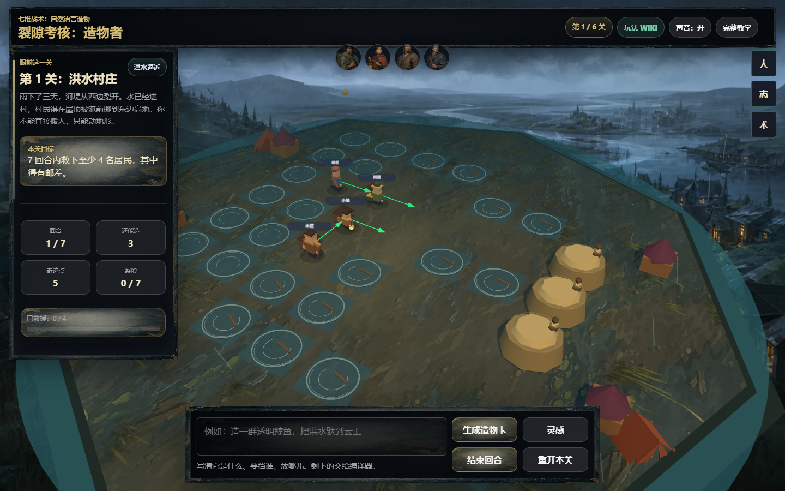
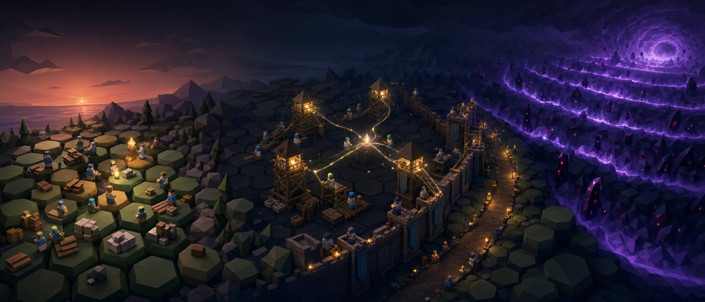
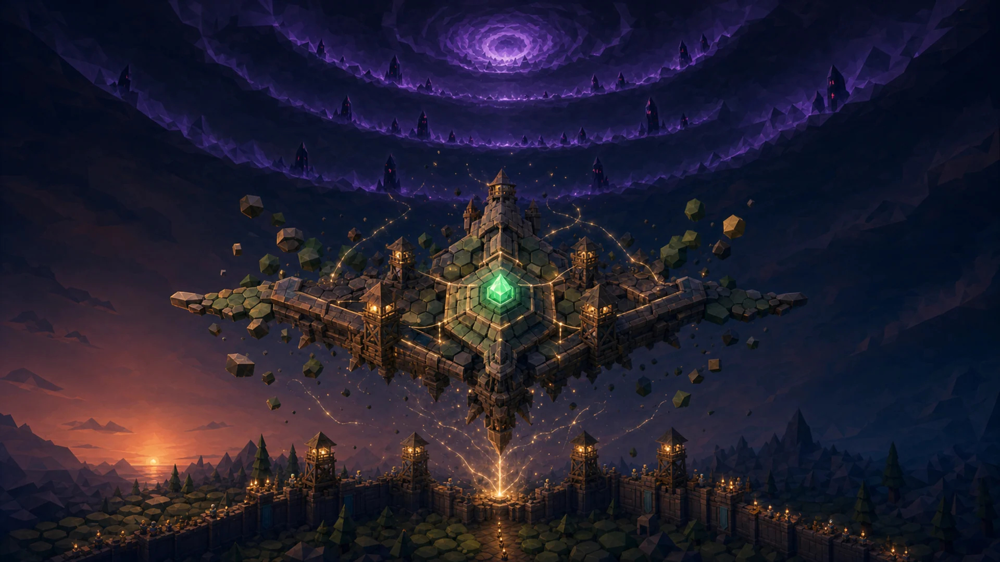

# 造物者考核 3D

<p align="center">
  
</p>

<p align="center">
  <strong>用一句自然语言创造能力，在会记住一切的世界里完成六场考核、长夜守城与第七日终战。</strong>
</p>

<p align="center">
  
  
  
  
  
</p>

> “你的使命不是消灭灾难，而是理解它们、与它们共存。”

《造物者考核 3D》是一款已经可以从序章完整体验到多时间线终章的 **AI 原生 3D 策略解谜游戏**。玩家不是从固定卡组中选择答案，而是描述自己想创造的事物；AI 会理解其中的意象、动作与限制，把语言编译为真正参与回合结算的游戏能力。

AI 也不是只在开局生成一张卡：它持续读取关卡目标、居民记忆、玩家造物、救援与牺牲记录，在 NPC 对话、Storyteller 事件、长夜塔计划、空域通讯和终局叙事中重新解释同一段玩家历史。换一种创造方式，后续世界就会给出不同回应。

## AI 不是装饰，而是核心玩法

这个项目把大模型放在“理解与生成层”，把确定性引擎放在“执行与裁决层”。AI 的输出会改变玩家拿到的造物、守夜塔方案和叙事反馈，但不能直接生成任意代码、绕过资源限制或宣布胜利。

| AI 层 | 读取的真实上下文 | 产生的游戏内容 | 安全边界 |
| --- | --- | --- | --- |
| **造物编译器** | 玩家原句、当前关卡、目标、灾害与资源 | 卡名、能力、范围、持续时间、消耗、副作用和特殊行为 | 能力必须落入枚举；数值受限；输出再次清洗 |
| **居民与叙事导演** | 居民身份、长期记忆、当前目标、玩家原话和世界事件 | 受角色记忆约束的对话、事件旁白、传说与空域通讯 | 不允许虚构未知人物、地点、任务或已完成事实 |
| **长夜重编译器** | 最多 18 张跨关造物、获救/失去居民、经历、传说、熵值 | 守夜主题、塔名、塔池、数值偏向、因果简报和三选一增益 | 塔型与增益走白名单；倍率和颜色经过夹取校验 |
| **终局叙事层** | 六关记录、守夜结果、空战结果、誓约与最终锚点 | Boss 台词、武器副作用、空域裁决与多时间线回声 | 碰撞、伤害、胜负和档案一致性仍由本地规则决定 |

```text
玩家语言 + 世界历史
        ↓
OpenAI-compatible 模型 ──→ 结构化候选内容
        ↓                         ↓
本地兜底生成器 ─────────→ 清洗 / 枚举 / 白名单 / 事实校验
                                  ↓
                         确定性游戏引擎执行
```

这种分层让 AI 对玩法产生实质影响，同时保留策略游戏需要的可解释性、可测试性与失败恢复能力。没有 API Key 时本地生成器可以保证完整通关；接入模型后，开放语言理解、角色回应和跨阶段叙事会更丰富，也更贴近玩家自己的表达。

## 实机画面

<p align="center">
  
</p>

<p align="center"><em>第一关“洪水村庄”：观察灾害、居民与行动意图，再用自然语言生成并放置造物。</em></p>

## 一条完整的游戏旅程

1. **六关地面考核**：洪水村庄、永夜矿井、巨兽困城、失语战争、记忆瘟疫与第七日前终考。
2. **长夜六更**：此前创造的卡牌、救下的居民和形成的誓约会转化为守夜塔与战场增益。
3. **第七日裂隙空域**：把造物武器化，驾驶裂隙载体完成六段 Boss 航线。
4. **多时间线终章**：系统根据真实通关记录生成档案、失败回声与最终锚点，并支持从世界志重播。

| 长夜守城 | 裂隙空域 |
| --- | --- |
|  |  |
| 六关记忆被重新编译为防线、塔计划与守夜誓约。 | 守夜结果成为空域载体、武器副作用与最终航线的一部分。 |

## 核心体验

### AI 造物编译器：从意象到可执行规则

输入“创造一群会把洪水搬到天空的透明鲸鱼”之类的描述，AI 会结合当前灾害和关卡目标，生成带有能力、范围、持续时间、消耗、副作用与特殊触发的结构化造物卡。最终效果会被规则引擎校验并真实作用于棋盘，而不是停留在描述文本里。

### 策略结果可解释、可预判

- 7×7 三维棋盘与回合制结算
- 敌方行动意图预览、灾害传播和路径可视化
- 11 种连锁反应、仪式熔炉、言灵誓约、认知深渊与造物者工坊
- 造物拆解、改造、融合和传承注入
- 教学战役覆盖六关、守城、空战及 31 次高级系统实践

### AI 叙事导演：世界真的会记住玩家

- 4 种 Storyteller 人格调整事件节奏与叙事语气
- NPC 回应会引用自己的身份、长期记忆、当前目标与玩家刚刚说的话
- 情绪、社交图谱、关系传播和单位传承会继续改变后续上下文
- 跨关卡居民、造物、传说、誓约和因果记忆会进入守夜与空域提示词
- 世界志、空域裁决与多时间线回声基于玩家实际行为生成，而不是固定结局文案

### 本地美术与声音形成连续演出

- 六关独立背景、棋盘表面、程序化 3D 环境与章节三镜头开场
- 20 名具备稳定身份造型和透明立绘的可交谈 NPC
- 长夜守城、空域终战与终章使用固定本地 CG
- 本地音效与分段配乐共享静音设置，不依赖运行时生成或第三方热链

## 快速体验

### 环境要求

- Node.js 18 或更高版本
- 支持 WebGL 与 ES Modules 的现代浏览器
- 首次加载 Three.js CDN 时需要网络；AI 服务本身是可选项

### 启动

```bash
git clone https://github.com/Ac-spider/creator-exam-3d.git
cd creator-exam-3d
npm start
```

浏览器打开：<http://localhost:3000>

项目没有 npm 生产依赖，也没有单独构建步骤；`npm start` 会直接运行原生 Node.js 服务。

### 调试与章节预览

- 考官沙盘：<http://localhost:3000/?debug=1>
- 强制重播第一章：<http://localhost:3000/?debug=1&chapter=1>
- 将 `chapter=1` 改为 `1` 到 `6` 可预览对应章节

普通玩家入口不会显示跳关、守城预演或空战预演工具。

## 接入 AI：解锁完整生成式体验

项目在没有 API Key 时仍能完整运行，这是可靠性兜底，不代表 AI 只是可有可无的装饰。配置模型后，系统会启用开放式造物理解、事实约束的居民对话、动态叙事、个性化守夜塔计划与空域文本，这才是项目设计的完整体验。

复制 `.env.example` 为 `.env`，配置任意 OpenAI-compatible Chat Completions 服务：

```env
AI_API_KEY=your_api_key
AI_BASE_URL=https://your-endpoint.example/v1
AI_MODEL=your_model
PORT=3000
```

AI 请求由本地 Node.js 网关统一代理，浏览器不会直接持有 API Key。当前接入点包括：

- `POST /api/compile-creation`：把开放式自然语言编译为结构化造物卡
- `POST /api/resident-dialogue`：根据居民记忆与玩家原话生成受事实约束的回应
- `POST /api/narrative`：生成事件、世界传说、守夜通讯与空域叙事
- `POST /api/night-watch-towers`：把跨关造物和居民历史重编译为守夜塔计划

实时战斗、碰撞、资源、伤害和胜负始终由本地规则执行；AI 超时、预算耗尽、返回无效结构或服务不可用时会自动使用本地兜底，不会阻断游戏。

## 技术实现

| 层级 | 实现 |
| --- | --- |
| 3D 地面主游戏 | Three.js、ES Modules、InstancedMesh、7×7 回合制棋盘 |
| 长夜守城 | 独立 Canvas 塔防模式，消费主线跨关记忆 |
| 裂隙空域 | 独立 Canvas 空战模式，回写统一终局结果 |
| 后端 | Node.js 原生 HTTP 静态服务与 AI 代理，无 Web 框架 |
| AI | OpenAI-compatible 编排、结构化输出校验、事实约束、预算控制与本地兜底 |
| 状态 | localStorage / sessionStorage 跨模式契约与存档 |
| 测试 | 原生 Node.js 测试与浏览器烟测脚本 |

核心分层保持可测试性：

```text
GameEngine（无 DOM 的规则与状态）
    ↑
CreatorExam3D（Three.js 渲染与玩家交互）
    ├── Night Watch（长夜守城）
    ├── Air Combat（裂隙空域）
    └── Timeline Ending（多时间线终章）
```

## 验证项目

```bash
npm run check
npm run test:reality
npm run test:tutorial
```

- `check`：检查全部 JavaScript 文件语法
- `test:reality`：验证当前代码与关键运行契约一致
- `test:tutorial`：验证六关教学黄金路线、固定卡牌和 31 项系统教学

完整回归可运行：

```bash
node debug/test-suite.js
```

## 项目结构

```text
creator-exam-3d/
├── server.js                  # 静态服务、AI 代理与本地兜底
├── server/                    # 后端 AI 网关和守夜生成逻辑
├── public/
│   ├── index.html             # 主游戏入口
│   ├── js/                    # 规则、渲染、叙事、NPC 与教学系统
│   ├── modes/
│   │   ├── tower-defense/     # 长夜守城
│   │   └── air-combat/        # 第七日裂隙空域
│   └── assets/                # CG、立绘、模型、纹理、音效与配乐
├── debug/                     # 自动化测试、烟测与视觉 QA 工具
└── docs/                      # 架构、系统设计与迭代记录
```

## 深入阅读

- [系统架构](./docs/systems/architecture.md)
- [教学模式设计](./docs/systems/tutorial-mode.md)
- [多时间线终章](./docs/systems/timeline-ending.md)
- [美术资源来源](./public/assets/art/ATTRIBUTION.md)
- [模型、纹理与音频来源](./public/assets/ATTRIBUTION.md)

## 当前状态

当前仓库是完整可体验、可演示的成品版本：主线、教学、守城、空战、终章、本地 AI 兜底、固定美术与自动验证链路均已接通。后续仍可扩展更多关卡、能力或平台适配，但不影响现有完整流程。
